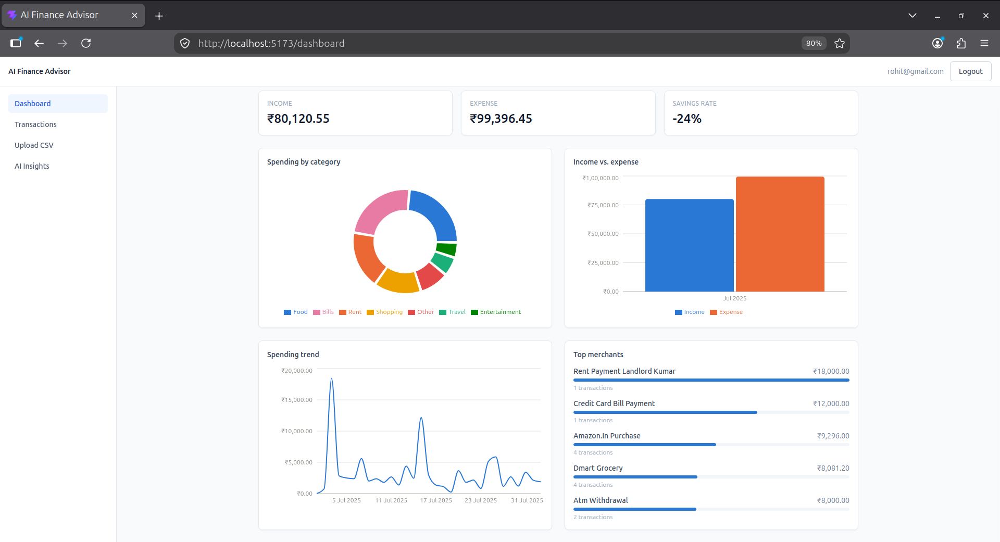
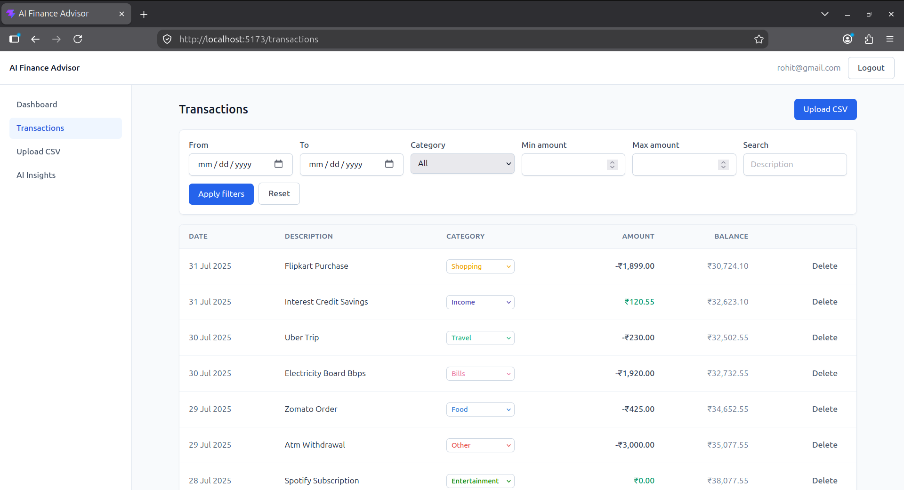
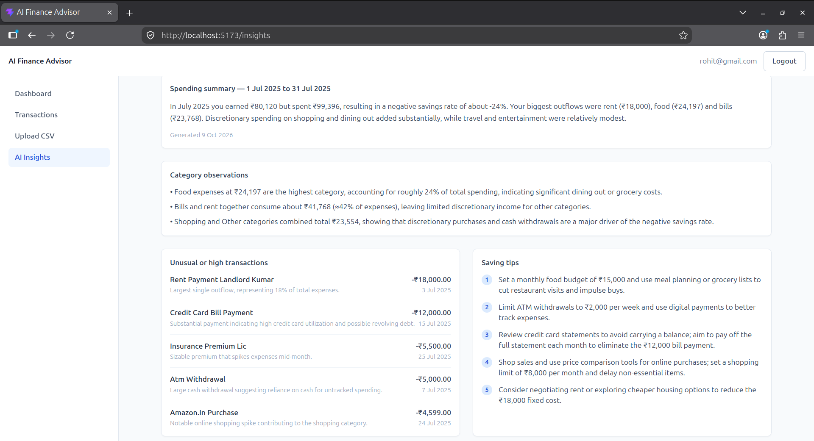

# AI Personal Finance Advisor

Upload a bank statement, get a categorised spending dashboard, and ask an LLM for a plain-language
read on your money — spending summary, flagged transactions, and saving tips.
## LIVE LINK - https://ai-finance-advisor-3.onrender.com/
## sample credentials - 
   email - rohit@gmail.com
   password - 123456789

## Stack

- **Frontend** — React, Vite, TypeScript, Tailwind, Recharts
- **Backend** — Node.js, Express, TypeScript, Prisma
- **Database** — PostgreSQL
- **Auth** — JWT in an HTTP-only cookie
- **AI** — OpenRouter (model is swappable via env var)

## Running it locally

```bash
# backend
cd backend
cp .env.example .env        # fill in DATABASE_URL and OPENROUTER_API_KEY
npm install
npx prisma migrate dev --name init
npm run seed                 # optional — demo@example.com / password123, 62 sample transactions
npm run dev                  # http://localhost:4000

# frontend
cd frontend
cp .env.example .env
npm install
npm run dev                  # http://localhost:5173
```

Needs a Postgres database — local, Docker, or a free instance on Neon/Supabase/Railway all work.
If you're on a pooled connection (Neon, Supabase, PgBouncer), set `DIRECT_URL` to the *unpooled*
connection string too — migrations hang indefinitely against a pooled one.

## Deployment

**Frontend → Vercel.** Root directory `frontend`, framework auto-detected. Set `VITE_API_URL`
to your backend's `/api` URL. `vercel.json` already handles the SPA rewrite for client-side routes.

**Backend → Render / Railway / Fly.io.** It's a stateful server, not a serverless function, so it
doesn't belong on Vercel. Set the variables from `.env.example`, pointing `CLIENT_ORIGIN` at the
Vercel URL. `Dockerfile` is there if the host wants a container.

Since frontend and backend end up on different domains, the auth cookie needs `sameSite: "none"`
and `secure: true` in production — already wired up via `NODE_ENV` in `auth.controller.ts`. CORS
only allows the origin(s) in `CLIENT_ORIGIN`, no wildcard.

## How categorisation works

Keyword rules against the transaction description (`constants/categories.ts`), first match wins,
everything else falls into "Other". No ML, no API call — deterministic and free. A user's manual
category edit always sticks; re-import never overwrites it.

## How the AI prompt works

The backend doesn't hand raw transactions to the model. It pre-aggregates the last ~90 days —
category totals, monthly income/expense, savings rate, top merchants, and the 10 largest debits —
and asks for strict JSON back (summary, unusual transactions, observations, tips), told explicitly
not to invent numbers that aren't in the data. Response is schema-validated before it's saved, so
a bad model reply just asks the user to retry instead of breaking the page.

## API

Full endpoint list with sample requests/responses: [docs/API.md](https://github.com/rohitanil2603/ai-finance-advisor/blob/main/docs/API.md).

## Test credentials

`rohit@gmail.com` / `123456789` after running `npm run seed` — 62 transactions from
`sample-data/sample_transactions.csv`.

## Screenshots

| Dashboard | Transactions | AI Insights |
|---|---|---|
|  |  |  |  |
